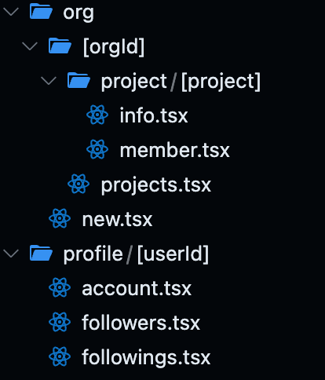

## Rise Start

> Smoothly start development using file-based model routing.


- [Rise Start](#rise-start)
- [Usage](#usage)
- [Example](#example)
    - [Structure of model file](#structure-of-model-file)
- [More Examples](#more-examples)
  - [`models/index.tsx → /`](#modelsindextsx--)
  - [`models/org/[orgId].tsx → /org/{orgId}`](#modelsorgorgidtsx--orgorgid)
  - [`models/org/[orgId]/index.tsx → /org/{orgId}/`](#modelsorgorgidindextsx--orgorgid)
  - [`models/org/[orgId]/project/[projectId].tsx → /org/{orgId}/project/{projectId}`](#modelsorgorgidprojectprojectidtsx--orgorgidprojectprojectid)


## Usage

```tsx
import { createWSServer } from '@rise-tools/server'
import { createModelRoutes } from '....'

const models = createModelRoutes()

createWSServer(models, port)
```

## Example

<table>
<tr>
<td>the file structure
<td>the model object during runtime
<tr>
<td>

<td>

```tsx
const models = {
  org: {
    '': lookup((origId) => ({
            project: lookup((projectId) => ({
                '': () => {},
                member: () => {},
            })),
            projects: () => {},
        })),
    new: () => {},
  },
  profile: lookup((userId) => ({
    account: () => {},
    followers: () => {},
    followings: () => {},
  })),
}

```


</td>
</tr>
</table>


#### Structure of model file

```tsx
// models/profile/[userId]/index.tsx
export const query = createQuery((param) => {
  await db.getUser(param)
})

// const ... = get(query)
export default function UserProfileModel({ query, param: userId }) {
    return <JSX />
}

```


## More Examples

### `models/index.tsx → /`

```tsx
const models={
  "": () => <JSX/>
}
```


### `models/org/[orgId].tsx → /org/{orgId}`


```tsx
const models = {
  org: lookup((orgId) =>
    view(() => {
      return <JSX />
    })
  ),
}
```


### `models/org/[orgId]/index.tsx → /org/{orgId}/`


```tsx
const models = {
  org: lookup((orgId) => ({
    '': view(() => {
      return <JSX />
    }),
  })),
}
```

### `models/org/[orgId]/project/[projectId].tsx → /org/{orgId}/project/{projectId}`


```tsx
const models = {
  org: lookup((orgId) => {
    return {
      project: lookup((orgId) => {
        return view(() => {
          return <JSX />
        })
      }),
    }
  }),
}
```


